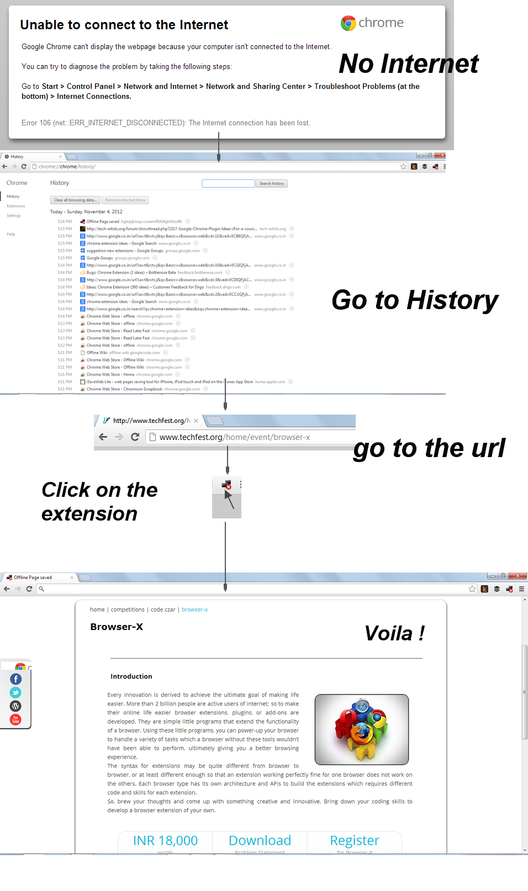

*Save all your webpages for offline use*

Lifeline Chrome extension automatically saves all web-pages for later use in offline.
This chrome extension saves complete html and css mark-up and images, so saved page looks the same as online one.
It saves all the pages you have browsed since installing the extension.

*How to Use*

1.First download/clone the repo
2.Go to chrome://extensions/
3.Developer Mode -> Load unpacked extension.
4.Select the folder
6.